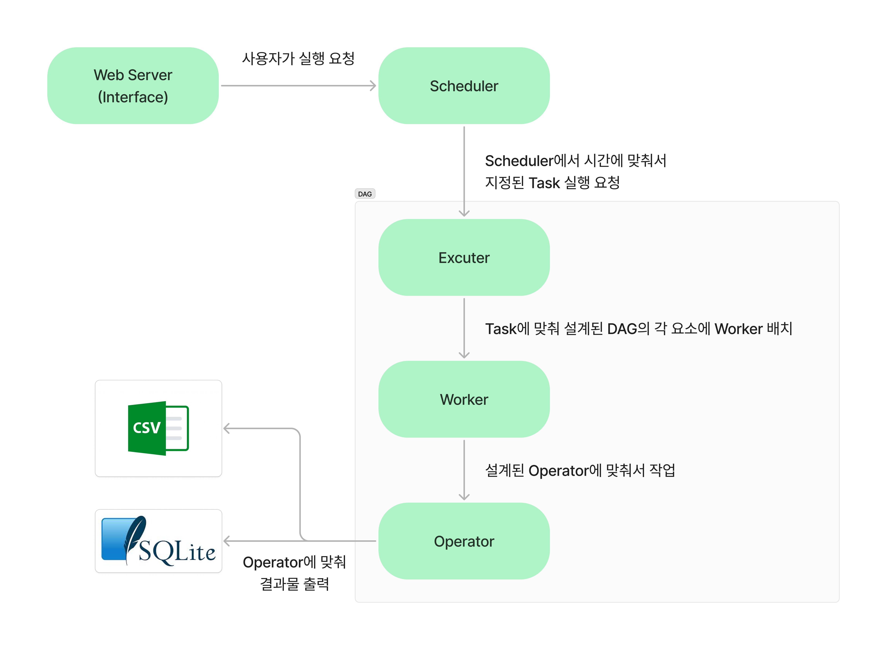
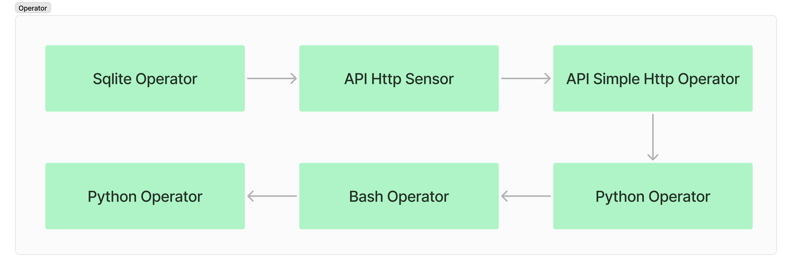

# Naver map API를 활용한 Airflow 예제

## 프로젝트 소개
airflow의 기초적인 동작 등을 확인하기 위해 naver map api를 이용해 키워드에 맞는 지역을 찾아서 그 정보를 CSV 파일로 저장하고 SQLite DB에 저장하는 과정을 하나의 DAG으로 만들었다.

## workflow

workflow를 정리해보면 위 이미지로 표현 가능하다.
- Web Server로 user에게 관리 interface를 제공하여 DAG의 실행을 관리하는 Scheduler에게 실행을 요청하도록 한다.
- Scheduler는 사용자가 요청한 조건에 맞춰서 Task를 실행하도록 Excuter에게 요청한다.
- Excuter는 DAG과 Operator의 설계에 맞게 Worker를 배치한다.
- Worker는 지정된 Operator를 실행해 순서에 맞게 과정을 처리한다.

## Operator

Operator는 위의 이미지에서 보이는 것처럼 구성했다.
1. SQLite에 Table을 생성하도록 하는 SQLite Operator
2. API가 작동하는지 확인할 수 있는 API Http Sensor
3. API에서 데이터를 요청하고 받아오는 API Simple Http Operator
4. 전처리를 위한 Pandas를 사용하는 Python Operator
5. Bash 명령어를 통해 CSV와 SQLite Table에 저장하도록 하는 Bash Operator
6. 완료를 알리기 위한 Python Operator